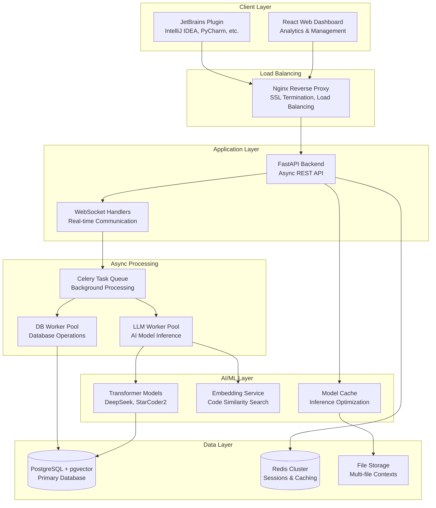
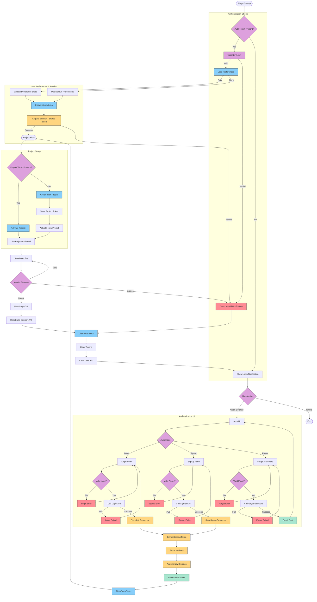
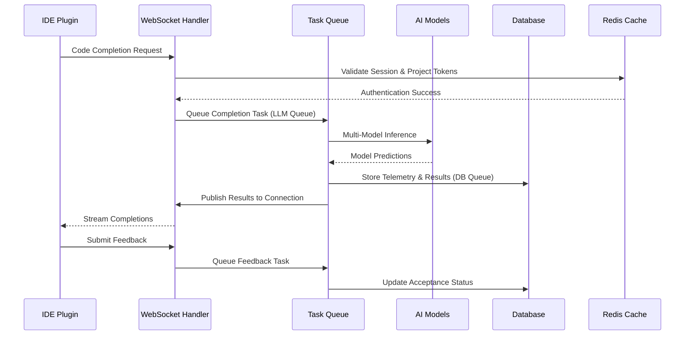
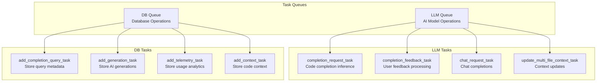
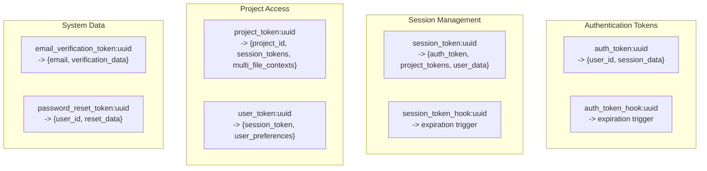
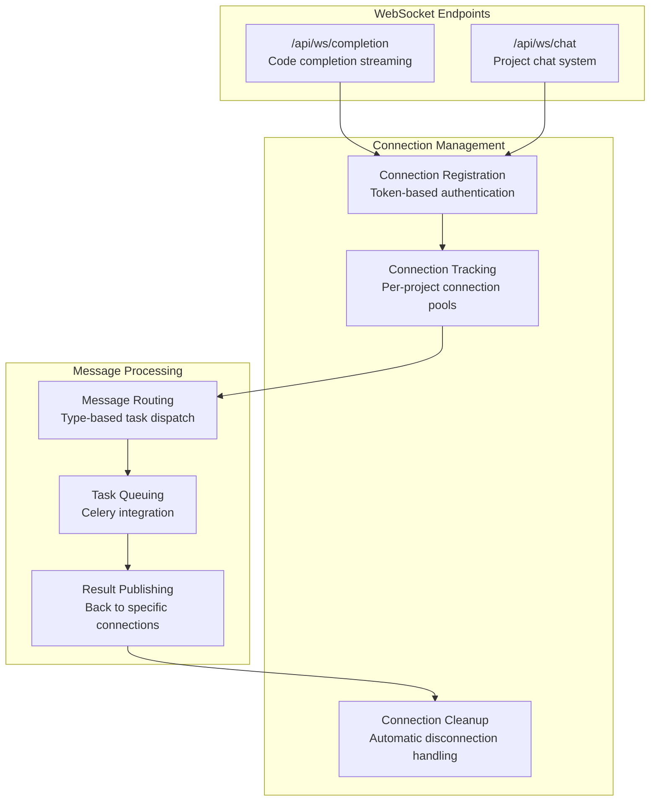

# Code4me V2 - AI-Powered Code Completion Platform

[](LICENSE)
[](https://python.org)
[](https://reactjs.org)
[](https://docker.com)
[](https://fastapi.tiangolo.com)
[](https://postgresql.org)
[](https://redis.io)

## 📋 Overview & Navigation

### 📖 Documentation Sections

| Section | Description | Key Topics |
|---------|-------------|------------|
| **[📖 Documentation Index](#-documentation-index)** | Official docs and resources | Auto-generated APIs, Database schemas |
| **[🎯 Project Overview](#-project-overview)** | Core features and capabilities | AI completion, Collaboration, Analytics |
| **[🐳 Docker Deployment](#-docker-deployment)** | Production deployment guide | Container setup, Environment config |
| **[🏗️ System Architecture](#️-system-architecture)** | Technical architecture overview | High-level design, Data flow, Auth layer |
| **[⚡ Asynchronous Processing](#-asynchronous-processing-with-celery)** | Celery task queue system | LLM tasks, DB tasks, Background processing |
| **[💾 Redis Data Management](#-redis-data-management)** | Session & cache management | Token lifecycle, Data structures, Cleanup |
| **[🔌 Real-time WebSocket](#-real-time-websocket-features)** | Live communication features | Code completion streaming, Chat system |
| **[🔐 Security & Secrets](#-security--secret-management)** | Security implementation | Secret detection, Auth, Privacy compliance |
| **[📚 API Reference](#-api-reference)** | REST API endpoints | Authentication, Completion, Projects |
| **[🗄️ Database Overview](#️-database-overview)** | PostgreSQL + pgvector setup | Schema design, Vector search, Migrations |
| **[🧪 Testing & QA](#-testing--quality-assurance)** | Testing strategy & coverage | Unit tests, Integration tests, Quality gates |
| **[🔧 Configuration](#-configuration-management)** | Environment & feature config | Variables, Feature flags, Performance tuning |
| **[🤝 Contributing](#-contributing--development)** | Development guidelines | Code standards, Architecture patterns |

### 🎯 Use Cases
- **Researchers**: AI model evaluation, Developer behavior analytics, Ground truth collection
- **Developers**: Real-time code completion, Multi-file context awareness, Project collaboration  
- **DevOps**: Scalable deployment, Session management, Performance monitoring
- **Security Teams**: Secret detection, Privacy compliance, Authentication systems

---

## 📖 Documentation Index

| Document                                                                           | Purpose                                        | Target Audience          |
| ---------------------------------------------------------------------------------- | ---------------------------------------------- | ------------------------ |
| **[This README](README.md)**                                                       | Project overview, quick start, deployment      | Everyone                 |
| **[Auto-Generated API Docs](https://drive.google.com/file/d/1m9aCCy-XWx4pJKxT0VUhZEepMMupFl9e/view?usp=sharing)** | Interactive FastAPI documentation (Swagger UI) | Developers, Integrators  |
| **[Database Documentation](src/database/resources/documentation/README.md)**       | Schema, migrations, CRUD operations            | Backend Developers, DBAs |

## 🎯 Project Overview

Code4me V2 is an AI-powered code completion platform developed for the **AISE laboratory at TU Delft**. It's designed as a research platform that combines transformer models with real-world developer workflows through a JetBrains Plugin integration.

### Core Features

#### 🤖 Code Completion

- **Multi-Model Support**: Simultaneous inference from multiple transformer models with performance comparison
- **Context-Aware Suggestions**: Real-time multi-file context analysis for improved completion relevance
- **Language Support**: Python, JavaScript, Java, C++, and more programming languages
- **Real-time Streaming**: WebSocket-based completion delivery with sub-second response times
- **Confidence Scoring**: Model confidence analysis for completion quality assessment

#### 👥 Collaborative Development

- **Project Management**: Multi-user project collaboration with role-based access control
- **Session Tracking**: Comprehensive development session analytics and user journey mapping
- **Chat Integration**: In-project real-time communication system with AI-assisted responses

#### 📊 Advanced Analytics & Telemetry

- **Behavioral Telemetry**: Typing speed, acceptance patterns, user interaction analytics
- **Contextual Telemetry**: Code context analysis, file paths, cursor position tracking
- **Performance Metrics**: Model response times, accuracy measurements, system performance
- **Ground Truth Collection**: User feedback collection for model evaluation and fine-tuning

#### 📈 Analytics Platform

- Dashboard Overview: system-wide KPIs and trends over configurable windows
- Usage Analytics: time-series volumes, acceptance rates by model/config/language/trigger, latency distributions, user behavior metrics
- Model Analytics: model comparison (acceptance, latency p50/p95, confidence) and slices
- Model Calibration: reliability diagrams and expected calibration error (ECE) per model
- A/B Testing (Admin): create/manage/evaluate studies with randomized config assignment
- Config Management (Admin): CRUD configs, list languages/models, validate HF models
- Access Control: All analytics endpoints require authentication. Non-admin users only see their own data; admin users can view cross-user aggregates and manage studies/configs.

#### 🔐 Enterprise Security & Privacy

- **Multi-Authentication**: OAuth 2.0 (Google) and traditional email/password authentication
- **Session Management**: Redis-based distributed session handling with automatic expiration
- **Secret Detection**: Automatic detection and redaction of sensitive information in code
- **Rate Limiting**: Per-endpoint request throttling with configurable limits
- **Data Privacy**: GDPR-compliant user data handling with consent management

### Prerequisites

```bash
# Check required software
docker --version          # >= 20.10
docker-compose --version  # >= 2.0
python --version          # >= 3.11
node --version            # >= 18
```

# 🐳 Docker Deployment

## Required Containers

| Container | Image | Purpose |
|-----------|-------|---------|
| **db** | `pgvector/pgvector:pg16` | PostgreSQL with vector extensions |
| **redis** | `redis:7.0` | Session storage |
| **redis-celery** | `redis:7.0` | Task queue broker |
| **backend** | *Built from Dockerfile* | FastAPI server |
| **celery-worker** | *Built from Dockerfile* | AI/ML processing |
| **website** | `node:18` | React frontend |
| **nginx** | `nginx:1.25` | Reverse proxy |

## Quick Setup

### Initialize Data Directories
```bash
./setup_data_dir.sh
```

## Prerequisites

- **Docker** (version 20.10+) & **Docker Compose** (version 2.0+)
- **8GB+ RAM** (16GB+ recommended for production)
- **NVIDIA Docker** (for GPU support in celery workers)
- **30GB+ free disk space** (for model cache and data storage)

## Required Containers

The application uses a microservices architecture with these containers:

| Container | Image | Purpose | Port | Dependencies |
|-----------|-------|---------|------|--------------|
| **db** | `pgvector/pgvector:pg16` | PostgreSQL with vector extensions for embeddings | `5432` | None |
| **redis** | `redis:7.0` | Session storage and general caching | `6379` | None |
| **redis-celery** | `redis:7.0` | Celery message broker for task queues | `6380` | None |
| **backend** | *Built from Dockerfile* | FastAPI application server | `8080` | db, redis, redis-celery |
| **celery-worker** | *Built from Dockerfile* | AI/ML background processing with GPU support | - | redis-celery, db |
| **website** | `node:18` | React frontend application | `3000` | backend |
| **nginx** | `nginx:1.25` | Reverse proxy and load balancer | `8000` | website, backend |

### Optional Services
- **pgadmin** (`dpage/pgadmin4:8.11`) - Database administration UI (development only)
- **test_db** (`pgvector/pgvector:pg16`) - Test database for isolated testing environments
## Setup Guide

### 1. Environment Configuration
**Essential Environment Variables:**
```bash
# Database
DB_PASSWORD=your_secure_password
DB_HOST=db
DB_PORT=5432
DB_NAME=code4meV2

# Redis & Celery
REDIS_HOST=redis
REDIS_PORT=6379
CELERY_BROKER_HOST=redis-celery
CELERY_BROKER_PORT=6379

# Application
SERVER_HOST=0.0.0.0
SERVER_PORT=8080
DATA_DIR=./data

# Security
AUTHENTICATION_TOKEN_EXPIRES_IN_SECONDS=3600
SESSION_TOKEN_EXPIRES_IN_SECONDS=86400

# Optional: Development tools
PGADMIN_PORT=5050
PGADMIN_DEFAULT_EMAIL=admin@example.com
PGADMIN_DEFAULT_PASSWORD=admin_password
```

### 2. Initialize Data Directories

Create persistent storage directories:
```bash
chmod +x setup_data_dir.sh
./setup_data_dir.sh
```

This creates the directory structure:
```
./data/
├── postgres/      # Database data
├── redis/         # Cache data  
├── redis_celery/  # Task queue data
├── celery_worker/ # Worker data & model cache
├── website/       # Node.js modules
└── hf/           # Hugging Face model cache
```

### 3. Deploy

**Option A: Full Production Stack**
```bash
# Start all services
docker-compose up -d

# Check health status
docker-compose ps
```

**Option B: Development Environment**
```bash
# Start infrastructure only
docker-compose up -d db redis redis-celery pgadmin

# Run backend locally for development
python -m venv venv
source venv/bin/activate  # Windows: venv\Scripts\activate
pip install -r requirements.txt
export PYTHONPATH=$PWD/src
python src/main.py
```

**Option C: Testing Setup**
```bash
# Start test database
docker-compose up -d test_db

# Run tests
export TEST_MODE=true
pytest tests/ --cov
```

## Verify Deployment

```bash
# Check container status
docker-compose ps

# View logs
docker-compose logs -f backend
docker-compose logs --tail=50 celery-worker

# Test application endpoints
curl http://localhost:8000/docs    # API documentation
curl http://localhost:8000/health  # Health check
```

**Expected Services:**
- API Documentation: `http://localhost:8000/docs`
- Frontend Application: `http://localhost:8000`
- Database Admin (dev): `http://localhost:5050`


## 🏗️ System Architecture

### High-Level Architecture Overview



### Complete Authentication layer



### Data Flow Architecture



## ⚡ Asynchronous Processing with Celery

### Task Queue Architecture

Code4me V2 uses **Celery with Redis** as the message broker to handle computationally intensive operations asynchronously, ensuring responsive user experience and horizontal scalability.

#### Task Queues



#### LLM Tasks (High Priority)

**`completion_request_task`**

- **Purpose**: Process AI model inference for code completions
- **Input**: Connection ID, tokens, completion request parameters
- **Process**: Multi-model parallel inference with confidence scoring
- **Output**: Completions published to WebSocket connection
- **Latency**: ~1-3 seconds per request

**`completion_feedback_task`**

- **Purpose**: Process user feedback on AI completions
- **Input**: Completion ID, acceptance status, feedback text
- **Process**: Update completion acceptance status and ground truth data
- **Output**: Feedback confirmation to client

**`chat_request_task`**

- **Purpose**: Handle conversational AI chat completions
- **Input**: Chat context, message history, project context
- **Process**: Generate contextual AI responses using project knowledge
- **Output**: Chat response streamed to WebSocket

**`update_multi_file_context_task`**

- **Purpose**: Update project-wide code context for better completions
- **Input**: File contents, project structure, context changes
- **Process**: Parse and index multi-file context for AI models
- **Output**: Updated context available for subsequent completions

#### DB Tasks (Background Processing)

**`add_completion_query_task`**

- **Purpose**: Store completion request metadata for analytics
- **Data**: User ID, session, context, telemetry, model parameters
- **Storage**: PostgreSQL with indexed fields for fast queries

**`add_generation_task`**

- **Purpose**: Store AI model responses and performance metrics
- **Data**: Model outputs, generation time, confidence scores
- **Analytics**: Model performance comparison and optimization

**`add_telemetry_task`**

- **Purpose**: Store comprehensive user behavior analytics
- **Data**: Typing patterns, acceptance rates, interaction timings
- **Research**: Developer behavior insights for research publication

**`add_context_task`**

- **Purpose**: Store code context with semantic embeddings
- **Data**: Code snippets, file metadata, vector embeddings
- **Search**: Enable semantic code search with pgvector

### Task Processing Flow

The task processing flow follows a consistent pattern across all Celery tasks:

1. **Authentication Validation**: Verify session and project tokens using Redis
2. **Model Loading**: Initialize AI models and completion services
3. **Request Processing**: Execute the specific task (completion, feedback, chat, etc.)
4. **Result Publishing**: Send results back to WebSocket connection via message channels
5. **Error Handling**: Graceful error handling with client notification

**Key Implementation Files:**

- **[LLM Tasks](src/celery_app/tasks/llm_tasks.py)** - AI model processing tasks
- **[DB Tasks](src/celery_app/tasks/db_tasks.py)** - Database operation tasks
- **[Celery Configuration](src/celery_app/celery_app.py)** - Task routing and worker setup

## 💾 Redis Data Management

### Redis Architecture & Data Storage

Code4me V2 uses **Redis as a high-performance session store and cache**, managing authentication state, project access, and real-time connection tracking.

#### Redis Data Structures



#### Token Management & Expiration

**Authentication Tokens (`auth_token:*`)**

- **Lifetime**: 1 hour (configurable)
- **Data**: `{"user_id": "uuid", "expires_at": "timestamp"}`
- **Purpose**: Primary authentication credential
- **Expiration**: Automatic cleanup with hook triggers

**Session Tokens (`session_token:*`)**

- **Lifetime**: 1 hour (configurable, renewable)
- **Data**: `{"auth_token": "uuid", "project_tokens": ["uuid1", "uuid2"], "user_preferences": {...}}`
- **Purpose**: Track active user sessions and project access
- **Cleanup**: Cascading deletion removes associated project tokens

**Project Tokens (`project_token:*`)**

- **Lifetime**: Tied to session lifetime
- **Data**: `{"project_id": "uuid", "session_tokens": ["uuid1"], "multi_file_contexts": {...}, "multi_file_context_changes": {...}}`
- **Purpose**: Project-specific access control and context storage
- **Context**: Stores active multi-file code contexts for AI models

#### Session Lifecycle Management

The Redis session management system handles the complete lifecycle of user sessions:

**Session Creation Process:**

1. Generate unique tokens (auth, session, project tokens)
2. Store authentication token with user metadata
3. Create session token linking to auth token and project access
4. Generate project-specific tokens with context storage
5. Set up expiration hooks for automatic cleanup

**Token Hierarchy:**

- **Auth Token** → Primary authentication credential
- **Session Token** → Links to auth token + project access list
- **Project Tokens** → Project-specific access + multi-file contexts
- **User Token** → User preferences and session data

**Implementation Details:**

- **[Redis Manager](src/backend/redis_manager.py)** - Complete session management implementation
- **[Authentication Utils](src/backend/utils.py)** - Token validation and JWT handling

#### Real-time Data Caching

**Multi-file Context Caching**

- **Storage**: Project tokens contain live code context
- **Purpose**: Provide AI models with multi-file awareness
- **Performance**: Sub-millisecond context retrieval
- **Persistence**: Periodically synced to PostgreSQL

**Connection Management**

- **WebSocket Tracking**: Active connections mapped to tokens
- **Pub/Sub Channels**: Real-time message distribution
- **Load Balancing**: Connection affinity across multiple backend instances

#### Expiration & Cleanup Strategy

The system implements automatic token cleanup using Redis key expiration events:

**Expiration Hooks:**

- Session and auth tokens have corresponding "hook" keys that expire before the main token
- Hook expiration triggers cleanup processes before the main token expires
- Cascading deletion ensures related tokens are cleaned up together

**Cleanup Process:**

- **Session Expiration**: Removes associated project tokens and updates database
- **Auth Token Expiration**: Invalidates all associated sessions
- **Project Token Cleanup**: Syncs multi-file contexts to PostgreSQL before deletion

**Background Monitoring:**

- Redis pub/sub listener monitors key expiration events
- Automatic database persistence for important session data
- Graceful handling of concurrent session cleanup

**Implementation:** See **[Redis Manager](src/backend/redis_manager.py)** for complete cleanup logic.

## 🔌 Real-time WebSocket Features

### WebSocket Architecture

Code4me V2 implements **real-time bidirectional communication** using WebSockets for instant code completion delivery, live chat, and collaborative features.

#### WebSocket Endpoints



#### Code Completion WebSocket (`/api/ws/completion`)

**Authentication Flow:**

1. Accept WebSocket connection from client
2. Validate session token from cookie against Redis
3. Extract and validate auth token from session data
4. Verify project token access and session linkage
5. Register connection with Celery broker for result publishing
6. Begin listening for completion requests and feedback

**Connection Management:**

- Each connection gets unique ID for result routing
- Connections are mapped to project tokens for broadcast capabilities
- Automatic cleanup on disconnection or error
- Support for multiple connections per user/project

**Implementation:** See **[WebSocket Completion Handler](src/backend/routers/ws/completion.py)** for complete flow.

#### Connection Management & Scaling

**Connection Registration System:**

- WebSocket connections are registered with unique IDs
- Connections are mapped to authentication tokens for access control
- Support for broadcasting messages to all connections in a project
- Automatic cleanup when connections are terminated

**Task Result Publishing:**

- Celery tasks publish results to specific message channels
- Results are routed back to the originating WebSocket connection
- Support for real-time streaming of AI model outputs
- Error handling with graceful degradation

**Implementation Files:**

- **[WebSocket Manager](src/backend/websocket_manager.py)** - Connection tracking and management
- **[Celery Broker Integration](src/App.py)** - Task result publishing
- **[WebSocket Routers](src/backend/routers/ws/)** - Completion and chat handlers

## 🔐 Security & Secret Management

### Multi-layered Security Architecture

Code4me V2 implements **security measures** including automated secret detection, multi-factor authentication, and privacy-preserving data handling.

#### Secret Detection & Redaction

**Automated Secret Scanning:**
The system uses the `detect-secrets` library with multiple detection plugins to identify sensitive information in code:

**Supported Secret Types:**

- **Cloud Providers**: AWS access keys, Azure storage keys, Google Cloud credentials
- **Development Platforms**: GitHub tokens, GitLab keys, JetBrains licenses
- **Communication**: Slack tokens, Discord bot tokens, Telegram credentials
- **Payment Systems**: Stripe API keys, PayPal credentials
- **AI/ML Services**: OpenAI API keys, Hugging Face tokens
- **Infrastructure**: Database connection strings, SSH private keys
- **High Entropy**: Base64/hex encoded secrets, random API keys
- **Authentication**: JWT tokens, basic auth credentials

**Real-time Processing:**

- Secrets are detected during code completion requests
- Automatic redaction with placeholder replacement
- Configurable sensitivity levels and detection thresholds
- Performance-optimized scanning for real-time use

**Implementation:** See **[Secret Detection Utils](src/utils.py)** for complete detection and redaction logic.

#### Authentication & Authorization

**Multi-Authentication Support:**
The system supports both traditional email/password authentication and OAuth 2.0 (Google) authentication:

**Authentication:**

- Email and password validation against database
- Argon2 password hashing with salt for security
- Secure password verification with timing attack protection
- Account creation with email verification workflow

**OAuth 2.0 Flow:**

- Client receives JWT token from Google OAuth
- Server validates JWT token using Google's public keys
- User information extracted from verified token
- Existing user lookup or account creation process
- Session and authentication tokens generated

**Security Features:**

- **Password Hashing**: Argon2 with configurable work factors
- **JWT Validation**: Google OAuth token verification with public key validation
- **Session Security**: HttpOnly cookies, SameSite protection
- **Rate Limiting**: Per-IP, per-endpoint request throttling

**Implementation Files:**

- **[Authentication Router](src/backend/routers/user/authenticate.py)** - Login and OAuth handling
- **[Password Utils](src/utils.py)** - Secure password hashing and verification
- **[JWT Utils](src/backend/utils.py)** - Token validation and processing

#### Session Security

**Secure Session Management**

- **HttpOnly Cookies**: Prevent XSS access to auth tokens
- **SameSite Protection**: CSRF prevention
- **Automatic Expiration**: Configurable session timeouts
- **Token Rotation**: New tokens on sensitive operations

**Rate Limiting**

```python
class SimpleRateLimiter(BaseHTTPMiddleware):
    """Per-IP, per-endpoint rate limiting."""

    def __init__(self, app: FastAPI):
        self.request_counts: Dict[str, int] = {}
        self.locks: Dict[str, threading.Lock] = {}

    async def dispatch(self, request: Request, call_next):
        client_key = f"{request.client.host}:{request.url.path}"

        with self.locks.get(client_key, threading.Lock()):
            current_count = self.request_counts.get(client_key, 0)
            rate_limit = self._get_rate_limit(request.url.path)

            if current_count >= rate_limit:
                return JsonResponseWithStatus(
                    status_code=429,
                    content=TooManyRequests()
                )

            self.request_counts[client_key] = current_count + 1

        return await call_next(request)
```

#### Data Privacy & Compliance

**GDPR Compliance**

- **User Consent**: opt-in for telemetry collection
- **Data Minimization**: Only collect necessary data
- **Right to Deletion**: Complete user data removal
- **Data Portability**: Export user data in standard formats
- **Privacy by Design**: Privacy-preserving settings

**User Preference Controls**

```python
DEFAULT_USER_PREFERENCE = {
    "store_context": False,              # Code context storage
    "store_contextual_telemetry": True,  # Environment telemetry
    "store_behavioral_telemetry": True,  # Behavior analytics
    "allow_model_training": False,       # Model improvement consent
    "data_retention_days": 365          # Data retention period
}
```

**Encrypted Data Storage**

- **Database Encryption**: TLS encryption for all connections
- **Field-level Encryption**: Sensitive data encrypted at rest
- **Key Management**: Secure key rotation and storage
- **Audit Logging**: Complete access and modification logs

## 📚 API Reference

The Code4me V2 API is fully documented using FastAPI's automatic documentation generation. The analytics and config routers described below are browsable in Swagger under tags `Analytics`, `Usage Analytics`, `Model Analytics`, `Model Calibration`, `A/B Testing`, and `Config`: 

### Key API Endpoints

#### Authentication

```http
POST   /api/user/create/        # Create new user account
POST   /api/user/authenticate/  # User login
PUT    /api/user/update/        # Update user profile
DELETE /api/user/delete/        # Delete user account
```

#### Code Completion

```http
POST   /api/completion/request/                    # Request code completion
GET    /api/completion/{query_id}                  # Retrieve completion results
POST   /api/completion/feedback/                   # Submit completion feedback
POST   /api/completion/multi-file-context/update/ # Update project context
```

#### Real-time Features

```http
WS     /api/ws/completion   # Real-time completion streaming
WS     /api/ws/chat         # Project chat functionality
```

#### Project Management

```http
POST   /api/project/create/     # Create new project
GET    /api/project/{id}        # Get project details
PUT    /api/project/{id}        # Update project
DELETE /api/project/{id}        # Delete project
POST   /api/project/{id}/join   # Join project
```

#### Analytics

```http
GET    /api/analytics/overview/dashboard?time_window=1d|7d|30d&user_id=<admin>   # Dashboard KPIs and trends
GET    /api/analytics/usage/queries-over-time                                    # Time-bucketed query volumes
GET    /api/analytics/usage/acceptance-rates                                      # Acceptance rates by model/config/language/trigger
GET    /api/analytics/usage/latency-distribution                                  # Latency percentiles and raw samples
GET    /api/analytics/usage/user-behavior                                         # Per-user behavior metrics
GET    /api/analytics/models/comparison                                           # Multi-model comparison
GET    /api/analytics/calibration/reliability-diagram                             # Reliability bins + ECE
POST   /api/analytics/studies/create                                              # Create A/B study (Admin)
PUT    /api/analytics/studies/update/{study_id}                                   # Update study (Admin)
POST   /api/analytics/studies/assign                                              # Assign users (Admin)
GET    /api/analytics/studies/list                                                # List studies (Admin)
GET    /api/analytics/studies/active                                              # Get active study (Admin)
POST   /api/analytics/studies/deactivate/{study_id}                               # Deactivate study (Admin)
GET    /api/analytics/studies/evaluate                                            # Evaluate outcomes (Admin)
```

Common parameters:
- All analytics endpoints require authentication.
- Non-admin users: automatically filtered to their own data; user_id is ignored.
- Admin users: may supply user_id for cross-user slices.
- Time filters accept ISO 8601 timestamps; overview uses time_window.
- Granularity values: 5m, 15m, 1h, 1d (where applicable).

#### Config (Admin)

```http
GET    /api/config/                                     # List all configs
GET    /api/config/{config_id}                          # Get a config
POST   /api/config/                                     # Create a config
PUT    /api/config/{config_id}                          # Update a config
DELETE /api/config/{config_id}                          # Delete a config
GET    /api/config/languages                            # Supported languages
GET    /api/config/models                               # Available models
GET    /api/config/models/validate?name=org/model       # Validate HF model exists
```

#### User

```http
GET    /api/user/get                                    # Get current user (from auth_token cookie)
```

Note: User objects in responses include `is_admin: boolean`. The website enables admin-only analytics tabs (A/B Testing, Config Management) when `is_admin` is true, and the backend authorizes cross-user analytics only for admins.

> **💡 Pro Tip**: When running the server locally, visit `http://localhost:8008/docs` for the full interactive API documentation with request/response schemas, authentication details, and live testing capabilities.

## 🗄️ Database Overview

The system uses PostgreSQL with pgvector extension for efficient similarity search:

### Core Tables

- **Users**: Authentication and profile management with OAuth support
- **Projects**: Collaborative development workspaces with multi-file context
- **Sessions**: Development session tracking and analytics
- **Completions**: AI-generated code suggestions with performance metrics
- **Telemetry**: Comprehensive usage analytics for research insights
- **Context**: Multi-file code context storage with vector embeddings

### Key Features

- **Polymorphic Inheritance**: Flexible query type system for different completion types
- **Vector Embeddings**: Semantic code search with pgvector for similar code discovery
- **Migration System**: Hybrid SQL initialization + Alembic migrations for schema evolution
- **Comprehensive Indexing**: Optimized for high-volume analytics queries
- **Multi-tenant Support**: Project-based data isolation and access control

> **📋 Database Details**: See **[Database Documentation](src/database/resources/documentation/README.md)** for complete schema, relationships, migration guides, and performance optimization strategies.

## 🧪 Testing & Quality Assurance

### Test Coverage & Strategy

```bash
# Run all tests with coverage
pytest --cov=src tests/

# Backend unit tests
pytest tests/backend_tests/

```

### Test Architecture

- **Unit Tests**: Individual component testing ([80%+ coverage target](src/backend/resources/documentation/coverage report.pdf) ) 
- **Integration Tests**: testing with real database
- **WebSocket Tests**: Real-time communication validation
- **Database Tests**: CRUD operation validation and migration testing

### Quality Gates

- **Pre-commit Hooks**: Automatic code formatting and linting
- **CI/CD Pipeline**: Automated testing on every commit
- **Security Scanning**: Automated vulnerability detection

## 🔧 Configuration Management

### Environment Variables

Key configuration options (see `.env` for complete list):

```bash
# Server Configuration
SERVER_HOST=0.0.0.0
SERVER_PORT=8008
TEST_MODE=false
SERVER_VERSION_ID=1

# Database Configuration
DB_HOST=localhost
DB_PORT=5432
DB_NAME=code4me_v2
DB_USER=postgres
DB_PASSWORD=your_secure_password

# Redis Configuration
REDIS_HOST=localhost
REDIS_PORT=6379

# Celery Configuration
CELERY_BROKER_HOST=redis-celery
CELERY_BROKER_PORT=6379

# Authentication & Security
AUTHENTICATION_TOKEN_EXPIRES_IN_SECONDS=3600
SESSION_TOKEN_EXPIRES_IN_SECONDS=3600
EMAIL_VERIFICATION_TOKEN_EXPIRES_IN_SECONDS=86400
PASSWORD_RESET_TOKEN_EXPIRES_IN_SECONDS=900

# OAuth Configuration
GOOGLE_OAUTH_CLIENT_ID=your_client_id
GOOGLE_OAUTH_CLIENT_SECRET=your_client_secret

# AI Model Configuration
HUGGINGFACE_TOKEN=your_hf_token
DEFAULT_MODEL_IDS=1,2
THREAD_POOL_MAX_WORKERS=4

# Rate Limiting
RATE_LIMIT_COMPLETION_REQUEST=60
RATE_LIMIT_USER_CREATE=5
RATE_LIMIT_USER_AUTHENTICATE=10

# Data Storage
DATA_DIR=./data
STORE_MULTI_FILE_CONTEXT_ON_DB=true
```

### Feature Flags & Toggles

The application uses Pydantic-based configuration with validation for feature management:

**Key Configuration Categories:**

- **Feature Toggles**: Enable/disable secret detection, multi-model inference, telemetry collection
- **Performance Tuning**: Max completion tokens, timeout settings, concurrent request limits
- **Security Settings**: Token expiration times, rate limiting thresholds
- **AI Model Configuration**: Default model selection, inference parameters
- **Data Storage**: Context storage preferences, retention policies

**Implementation:** See **[Configuration Class](src/Code4meV2Config.py)** for complete configuration options and validation.


## 🤝 Contributing & Development

### Code Quality Standards

**Development Standards:**

- **Type Hints**: Full type annotations for better IDE support and runtime validation
- **Documentation**: Comprehensive docstrings using Google/NumPy style
- **Testing**: Unit tests with coverage requirement
- **Formatting**: Black code formatting with Ruff linting
- **Security**: Secure coding practices with automated secret detection
- **Performance**: Consider performance implications and async best practices

**Code Structure:**

- Pydantic models for request/response validation with detailed field descriptions
- FastAPI dependency injection for clean separation of concerns
- SQLAlchemy ORM with proper relationship definitions
- Async/await patterns for I/O operations

**Example Standards:** See existing codebase files like **[Queries.py](src/Queries.py)** and **[database models](src/database/db_schemas.py)** for implementation examples.

## Resources

### Documentation Links

- **[Interactive API Reference](src/backend/resources/documentation/fastapi-doc.pdf)** - Swagger UI with live testing
- **[Database Guide](src/database/resources/documentation/README.md)** - Schema, migrations, and CRUD operations

### External Resources

- **[FastAPI Documentation](https://fastapi.tiangolo.com/)** - Web framework reference
- **[PostgreSQL Documentation](https://www.postgresql.org/docs/)** - Database documentation
- **[Redis Documentation](https://redis.io/docs/)** - Caching and session management
- **[Celery Documentation](https://docs.celeryproject.org/)** - Async task processing
- **[React Documentation](https://reactjs.org/docs/)** - Frontend framework
- **[Transformers Documentation](https://huggingface.co/docs/transformers/)** - AI model library

## 🙏 Acknowledgments

- **TU Delft AISE Laboratory** for research support, guidance, and academic collaboration
- **Hugging Face** for transformer model hosting, inference infrastructure, and model ecosystem
- **JetBrains** for IDE integration platform and development tools
- **FastAPI Community** for excellent async web framework and documentation

---