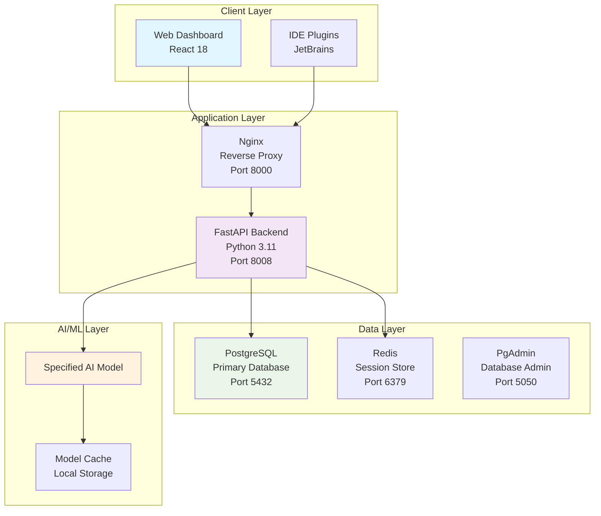
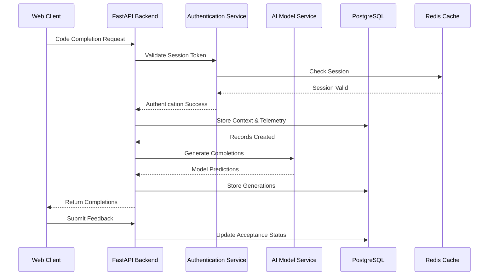
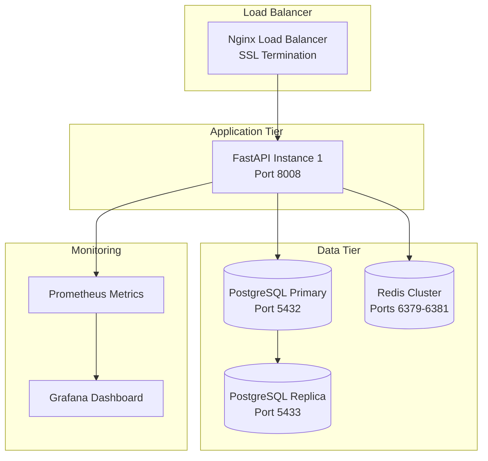
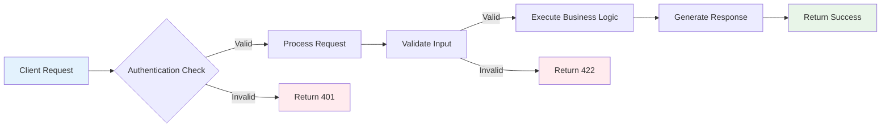
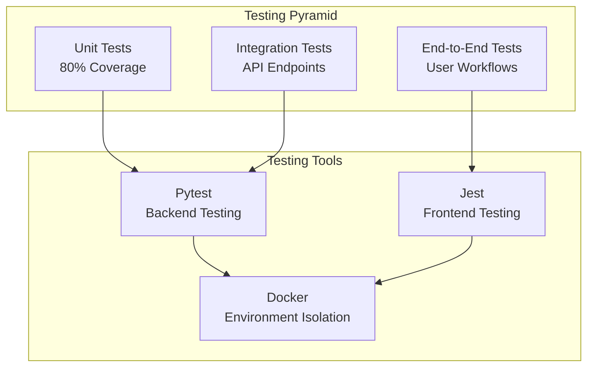
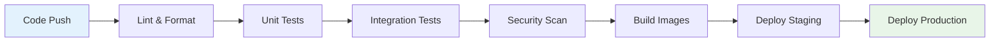
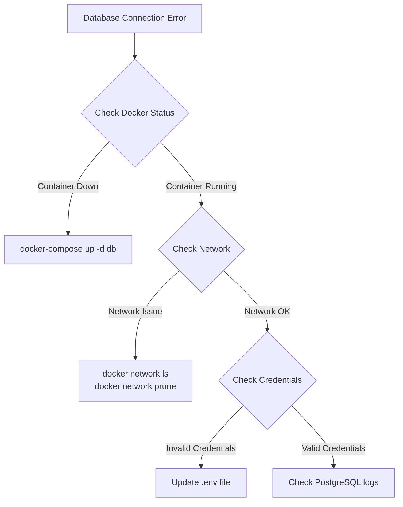

# Code4me V2 Backend

[](https://github.com/code4me/v2)
[](LICENSE)
[](https://python.org)
[](https://reactjs.org)
[](https://docker.com)
[](https://gitlab.com)

## Project Overview

Code4me V2 is a JetBrains Plugin developed as part of the software project for the AI4SE laboratory at **TU Delft**.
This project explores the intersection of artificial intelligence and software engineering by implementing an intelligent code completion plugin
that can leverage state-of-the-art transformer model.

### Research Objectives

This student project aims to create a platform which could allow researchers to address several key research needs in the field of AI-assisted software development:

- **Model Performance Analysis**: How do different transformer architectures (DeepSeek Coder vs. StarCoder2) perform in real-world code completion scenarios?
- **Context-Aware Completion**: Can multi-file context significantly improve completion accuracy and relevance?
- **Developer Interaction Patterns**: What telemetry data provides the most insight into effective code completion workflows?
- **Scalable AI Infrastructure**: How can we build production-ready AI systems that handle concurrent users while maintaining low latency?

### Technical Innovation

The platform demonstrates several innovative approaches to AI-powered development tools:

1. **Multi-Model Architecture**: Simultaneous inference from multiple AI models with performance comparison
2. **Dynamic Context Management**: Real-time multi-file context updates for improved completion relevance
3. **Comprehensive Telemetry**: Detailed user interaction tracking for research insights
4. **Feedback-Driven Learning**: Ground truth collection, making model fine-tuning research possible

---

## 📊 System Architecture

### High-Level Architecture Overview



### Component Interaction Flow



---

## 🛠 Technology Stack

### Backend Technologies

| Component              | Technology   | Version  | Purpose                     |
| ---------------------- | ------------ | -------- | --------------------------- |
| **Web Framework**      | FastAPI      | 0.115.0+ | High-performance async API  |
| **Database ORM**       | SQLAlchemy   | 2.0.30+  | Database abstraction layer  |
| **Authentication**     | Argon2 + JWT | 21.1.0+  | Secure password hashing     |
| **Session Management** | Redis        | 7.0+     | Distributed session storage |
| **AI/ML Framework**    | Transformers | 4.50.0+  | Model inference engine      |
| **Async Runtime**      | Uvicorn      | 0.34.0+  | ASGI server implementation  |

### Website Technologies

| Component            | Technology       | Version | Purpose                 |
| -------------------- | ---------------- | ------- | ----------------------- |
| **UI Framework**     | React            | 18+     | Component-based UI      |
| **State Management** | Context API      | -       | Application state       |
| **Styling**          | CSS Variables    | -       | Theming system          |
| **Authentication**   | Google OAuth     | 2.0     | Social authentication   |
| **Build Tool**       | Create React App | 5+      | Development environment |

### Infrastructure & DevOps

| Component             | Technology              | Purpose                          |
| --------------------- | ----------------------- | -------------------------------- |
| **Containerization**  | Docker + Docker Compose | Service orchestration            |
| **Reverse Proxy**     | Nginx                   | Load balancing & SSL termination |
| **CI/CD Pipeline**    | GitLab CI/CD            | Automated testing & deployment   |
| **Code Quality**      | Black, Ruff, Prettier   | Code formatting & linting        |
| **Testing Framework** | Pytest + Jest           | Automated testing                |

---

## 🏗 Database Architecture

### Schema Overview

The Code4me V2 platform utilizes a PostgreSQL database with a comprehensive schema designed for high-performance code completion analytics and user management.

### Database Documentation References

| Component                   | File Location                                                                                   | Description                             |
| --------------------------- |-------------------------------------------------------------------------------------------------| --------------------------------------- |
| **Database Documentation**  | [`src/database/resources/documentation/README.md`](src/database/resources/documentation/README) | Database documentation                  |
| **Schema Definition**       | [`src/database/db_schemas.py`](src/database/db_schemas.py)                                      | SQLAlchemy ORM models and relationships |
| **Database Initialization** | [`src/database/init.sql`](src/database/init.sql)                                                | Complete schema creation and seed data  |
| **Test Schema**             | [`src/database/init_test.sql`](src/database/init_test.sql)                                      | Test database schema setup              |
| **CRUD Operations**         | [`src/database/crud.py`](src/database/crud.py)                                                  | Database operation functions            |
| **Utilities**               | [`src/database/utils.py`](src/database/utils.py)                                                | Password hashing and validation         |

---

## 🚀 Installation & Deployment

### Prerequisites Checklist

- [ ] **Docker Engine** (20.10+) & **Docker Compose** (2.0+)
- [ ] **Network**: Ports 3000, 5432, 6379, 8000, 8008 available
- [ ] **Google OAuth Credentials** (for authentication)

### Production Deployment Architecture



### Deployment Commands

#### Option A: Single-Command Production Deployment

```bash
# Clone repository
# TODO: Replace with the actual repository URL when finalized
git clone https://github.com/your-org/code4me-v2.git
cd code4me-v2

# Configure environment
cp .env.production .env
nano .env  # Edit configuration

# Set up data directory structure
./setup_data_dir.sh

# Deploy with Docker Compose
docker-compose -f docker-compose.prod.yml up -d

# Verify deployment
docker-compose ps
docker-compose logs -f backend
```

> **Note**: The `DATA_DIR` variable in the `.env` file specifies where container data will be stored. Each container has its own subdirectory within this location. The `setup_data_dir.sh` script creates this directory structure automatically.

#### Option B: Development Environment

```bash
# Development setup
cp .env.development .env

# Set up data directory structure
./setup_data_dir.sh

# Start infrastructure services
docker-compose up -d db redis pgadmin

# Backend development
python -m venv venv
source venv/bin/activate  # On Windows: venv\Scripts\activate
pip install -r requirements.txt
export PYTHONPATH=$PWD/src
python src/main.py

# Frontend development (new terminal)
cd src/website
npm install
npm start
```

---

## 🔌 API Reference

### Authentication Endpoints

| Method   | Endpoint                  | Description                   | Request Body       | Response                       |
| -------- | ------------------------- | ----------------------------- | ------------------ | ------------------------------ |
| `POST`   | `/api/user/create/`       | Create new user account       | `CreateUser`       | `CreateUserPostResponse`       |
| `POST`   | `/api/user/authenticate/` | Authenticate user credentials | `AuthenticateUser` | `AuthenticateUserPostResponse` |
| `PUT`    | `/api/user/update/`       | Update user profile           | `UpdateUser`       | `UpdateUserPutResponse`        |
| `DELETE` | `/api/user/delete/`       | Delete user account           | Query params       | `DeleteUserDeleteResponse`     |

### Code Completion Endpoints

| Method | Endpoint                                     | Description                | Request Body             | Response                             |
| ------ | -------------------------------------------- | -------------------------- | ------------------------ | ------------------------------------ |
| `POST` | `/api/completion/request/`                   | Request code completion    | `RequestCompletion`      | `CompletionPostResponse`             |
| `GET`  | `/api/completion/{query_id}`                 | Retrieve completions by ID | Path param               | `CompletionPostResponse`             |
| `POST` | `/api/completion/feedback/`                  | Submit completion feedback | `FeedbackCompletion`     | `CompletionFeedbackPostResponse`     |
| `POST` | `/api/completion/multi-file-context/update/` | Update multi-file context  | `UpdateMultiFileContext` | `MultiFileContextUpdatePostResponse` |

### Request/Response Flow



---

## 🧪 Quality Assurance

### Testing Strategy



### Test Coverage Metrics

| Component               | Unit Tests | Integration Tests | Coverage Target |
| ----------------------- | ---------- | ----------------- | --------------- |
| **Authentication**      | ✅         | ✅                | 80%+            |
| **Code Completion**     | ✅         | ✅                | 80%+            |
| **Database Operations** | ✅         | ✅                | 80%+            |
| **API Endpoints**       | ✅         | ✅                | 80%+            |
| **Frontend Components** | ✅         | ✅                | 80%+            |

### CI/CD Pipeline



### Quality Gates

| Stage             | Criteria                         | Tools             |
| ----------------- | -------------------------------- | ----------------- |
| **Code Quality**  | Black, Ruff, Prettier compliance | Pre-commit hooks  |
| **Test Coverage** | >80% line coverage               | Pytest-cov        |
| **Security**      | No high/critical vulnerabilities | npm audit, safety |

---

### Scalability Considerations

| Component         | Scaling Strategy                 | Implementation             |
| ----------------- | -------------------------------- | -------------------------- |
| **API Service**   | Horizontal scaling               | Multiple FastAPI instances |
| **Database**      | Read replicas + sharding         | PostgreSQL cluster         |
| **Session Store** | Redis cluster                    | Multi-node Redis setup     |
| **AI Models**     | Model caching + GPU acceleration | NVIDIA GPU support         |

---

### Security Measures

| Category               | Implementation                               | Tools/Methods                     |
| ---------------------- | -------------------------------------------- | --------------------------------- |
| **Password Security**  | Argon2 hashing with salt                     | argon2-cffi library               |
| **Session Management** | Redis-based with expiration                  | JWT tokens, HTTP-only cookies     |
| **API Security**       | Rate limiting, input validation              | FastAPI validators, Redis limiter |
| **Database Security**  | Connection encryption, parameterized queries | SQLAlchemy ORM                    |
| **OAuth Integration**  | Google OAuth 2.0                             | @react-oauth/google               |

### Compliance & Best Practices

- **GDPR** data protection measures

- **Encrypted data transmission** (TLS 1.3)
- **Secure password policies** and MFA support

---

## 🛠 Development Guidelines

### Code Quality Standards

#### Python Example (Backend)

```python
# Example: Proper type hints and documentation
from typing import Optional, List
from pydantic import BaseModel, Field

class CompletionRequest(BaseModel):
    """Request model for code completion.

    Attributes:
        model_ids: List of AI model identifiers
        context: Code context information
        telemetry: User interaction telemetry
    """
    model_ids: List[int] = Field(..., description="AI models to use")
    context: ContextData = Field(..., description="Code context")
    telemetry: TelemetryData = Field(..., description="Usage metrics")
```

### Development Environment Setup

| Step                        | Command                           | Purpose                 |
| --------------------------- | --------------------------------- | ----------------------- |
| 1. **Clone Repository**     | `git clone <repo-url>`            | Get source code         |
| 2. **Install Pre-commit**   | `pre-commit install`              | Code quality automation |
| 3. **Setup Environment**    | `cp .env.development .env`        | Configure settings      |
| 4. **Start Services**       | `docker-compose up -d db redis`   | Infrastructure          |
| 5. **Install Dependencies** | `pip install -r requirements.txt` | Python packages         |
| 6. **Run Tests**            | `pytest --cov`                    | Verify setup            |

---

## 🚨 Troubleshooting Guide

### Common Issues & Solutions

#### Database Connection Issues



#### Model Loading Problems

| Issue               | Symptom                       | Solution                                        |
| ------------------- | ----------------------------- | ----------------------------------------------- |
| **Memory Error**    | `torch.cuda.OutOfMemoryError` | Increase system RAM or disable model preloading |
| **Model Not Found** | `Model 'xyz' not available`   | Verify model is registered in database          |
| **Slow Loading**    | Extended startup time         | Use SSD storage and adequate RAM                |
| **GPU Issues**      | CUDA errors                   | Verify NVIDIA drivers and Docker GPU support    |

#### Frontend Build Failures

```bash
# Common resolution steps
rm -rf node_modules package-lock.json
npm cache clean --force
npm install
npm run build

# For persistent issues
npm audit fix
npm update
```

---

## 📚 Additional Resources

### Links

| Resource                 | URL                                              | Description                               |
| ------------------------ | ------------------------------------------------ | ----------------------------------------- |
| **API Documentation**    | `http://localhost:8008/docs`                     | Interactive Swagger/OpenAPI documentation |
| **Database Schema**      | [`src/database/init.sql`](src/database/init.sql) | Complete database initialization script   |
| **Environment Config**   | [`.env.example`](.env.example)                   | Sample environment configuration          |
| **Docker Configuration** | [`docker-compose.yml`](docker-compose.yml)       | Service orchestration definition          |
| **Main Application**     | [`src/main.py`](src/main.py)                     | FastAPI application entry point           |
| **Frontend Source**      | [`src/website/`](src/website/)                   | React application source code             |
| **Requirements**         | [`requirements.txt`](requirements.txt)           | Python dependencies                       |
| **CI/CD Configuration**  | [`.gitlab-ci.yml`](.gitlab-ci.yml)               | GitLab CI/CD pipeline definition          |

### External Dependencies

| Technology       | Documentation                                                                 | Version Compatibility |
| ---------------- | ----------------------------------------------------------------------------- | --------------------- |
| **FastAPI**      | [fastapi.tiangolo.com](https://fastapi.tiangolo.com/)                         | 0.115.0+              |
| **PostgreSQL**   | [postgresql.org/docs](https://www.postgresql.org/docs/)                       | 16+                   |
| **Redis**        | [redis.io/docs](https://redis.io/docs/)                                       | 7.0+                  |
| **React**        | [reactjs.org/docs](https://reactjs.org/docs/)                                 | 18+                   |
| **Transformers** | [huggingface.co/docs/transformers](https://huggingface.co/docs/transformers/) | 4.50.0+               |

### Training & Practices

- [ ] **FastAPI Fundamentals** - Backend development
- [ ] **React Advanced Patterns** - Frontend development
- [ ] **PostgreSQL Administration** - Database management
- [ ] **Docker** - Container orchestration
- [ ] **AI/ML Model Deployment** - Production ML systems

_This documentation is maintained by the Code4me V2 development team and is updated regularly during the span of the project to reflect the current state of the platform._
