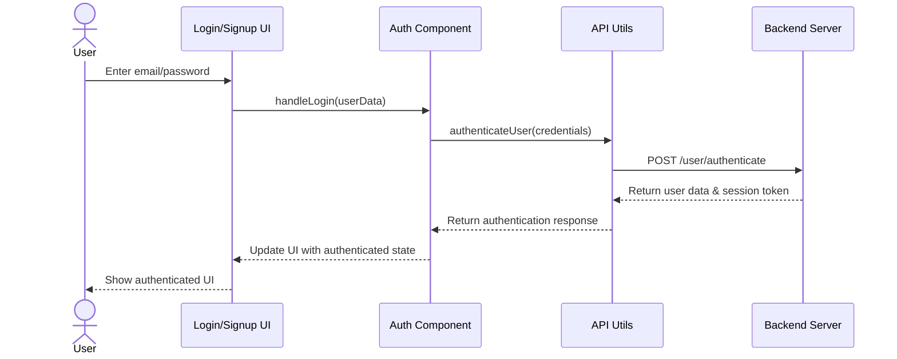
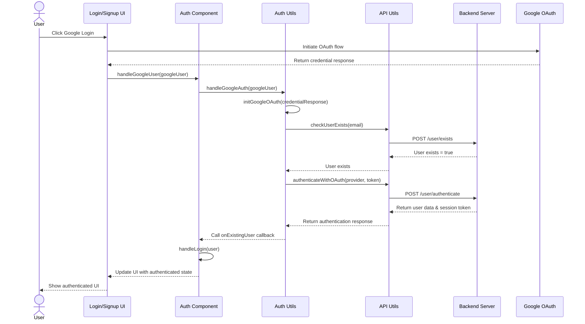
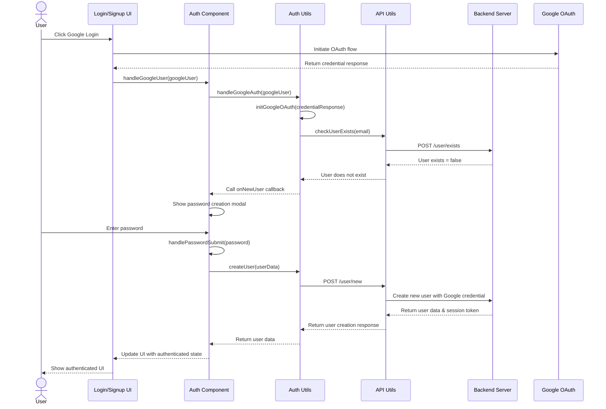
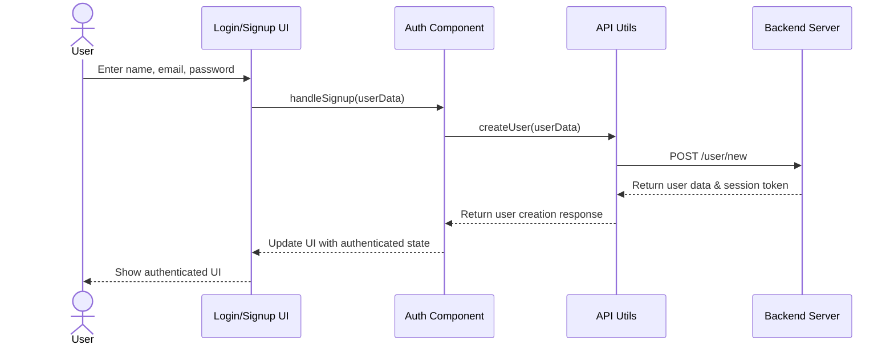

# Authentication Workflows Documentation

This document outlines the authentication workflows implemented in our application. It provides a detailed view of how different authentication methods work, including regular login/signup and Google OAuth integration.

## Authentication Flows

Our application supports four main authentication flows:

1. Regular Login (Email/Password)
2. Google OAuth Login (Existing User)
3. Google OAuth Signup (New User)
4. Regular Signup

Each flow is detailed below with sequence diagrams and explanations.

## 1. Regular Login Flow

This flow is used when a user logs in with their email and password.

**Process:**

1. User enters their email and password in the login form
2. The UI component passes these credentials to the Auth component
3. Auth component calls the authenticateUser function in the API utilities
4. API makes a POST request to the server's authentication endpoint
5. Server validates credentials and returns user data with a session token
6. The response is passed back through the chain
7. UI is updated to show the authenticated state

## 2. Google OAuth Login (Existing User)

This flow is used when an existing user logs in using Google OAuth.

**Process:**

1. User clicks the Google login button
2. The UI initiates the Google OAuth flow
3. Google returns a credential response with a JWT
4. The JWT is processed to extract user information
5. The system checks if the user already exists
6. For existing users, the system authenticates using the Google credential
7. The server validates the token and returns user data with a session token
8. The UI is updated to show the authenticated state

## 3. Google OAuth Signup (New User)

This flow is used when a new user signs up using Google OAuth.

**Process:**

1. User clicks the Google login button
2. The UI initiates the Google OAuth flow
3. Google returns a credential response with a JWT
4. The JWT is processed to extract user information
5. The system checks if the user already exists
6. For new users, a password creation modal is shown
7. User enters a password to complete the signup
8. The system creates a new user with the Google credential and password
9. The server returns user data with a session token
10. The UI is updated to show the authenticated state

## 4. Regular Signup Flow

This flow is used when a user signs up with email, name, and password.

**Process:**

1. User enters their name, email, and password in the signup form
2. The UI component passes this data to the Auth component
3. Auth component calls the createUser function
4. API makes a POST request to create a new user
5. Server creates the user and returns user data with a session token
6. The response is passed back through the chain
7. UI is updated to show the authenticated state

## Security Considerations

- All passwords are hashed before being sent to the server
- Google OAuth uses JWT tokens for secure authentication
- Session tokens are generated for maintaining authenticated state
- API endpoints are protected with appropriate security measures

## Data Flow

In all authentication flows, the following data is typically exchanged:

1. **User Credentials**: Email, password, or OAuth tokens
2. **User Information**: Name, email, and other profile data
3. **Session Tokens**: Used for maintaining authenticated state
4. **Error Messages**: When authentication fails

The system is designed to handle these flows securely and provide a seamless user experience.
