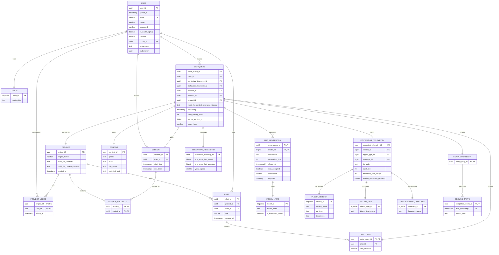

# Database Schema Documentation - Code4me V2

## Overview

The Code4me V2 database is designed to support AI-powered code completion and chat functionality with comprehensive telemetry tracking, project collaboration, and session management. Built on PostgreSQL with SQLAlchemy ORM, it features polymorphic inheritance, proper foreign key constraints, and optimized indexing.

### Database Schema Diagram



## 📊 Table Reference

### Core Entity Tables

#### `config`
Configuration settings shared across users.

| Column | Type | Constraints | Description |
|--------|------|-------------|-------------|
| `config_id` | BIGSERIAL | PK | Auto-incrementing primary key |
| `config_data` | TEXT | NOT NULL | JSON configuration data |


#### `user`
Enhanced user management with OAuth support and preferences.

| Column | Type | Constraints | Description |
|--------|------|-------------|-------------|
| `user_id` | UUID | PK | Primary key |
| `joined_at` | TIMESTAMP | NOT NULL | Account creation timestamp |
| `email` | VARCHAR | UNIQUE, NOT NULL | User email address |
| `name` | VARCHAR | NOT NULL | Display name |
| `password` | VARCHAR | NOT NULL | Argon2 hashed password |
| `is_oauth_signup` | BOOLEAN | DEFAULT FALSE | OAuth registration flag |
| `verified` | BOOLEAN | DEFAULT FALSE | Email verification status |
| `config_id` | BIGINT | FK, NOT NULL | Reference to config |
| `preference` | TEXT | NULL | User preferences (JSON) |
| `auth_token` | UUID | NULL | Authentication token |

**Relationships:**
- `config_id` → `config.config_id` (RESTRICT)

#### `project`
Collaborative workspaces for code completion and chat.

| Column | Type | Constraints | Description |
|--------|------|-------------|-------------|
| `project_id` | UUID | PK | Primary key |
| `project_name` | VARCHAR | NOT NULL | Project display name |
| `multi_file_contexts` | TEXT | DEFAULT '{}' | Multi-file context data (JSON) |
| `multi_file_context_changes` | TEXT | DEFAULT '{}' | Context change tracking (JSON) |
| `created_at` | TIMESTAMP | NOT NULL | Creation timestamp |

#### `project_users`
Many-to-many relationship between users and projects.

| Column | Type | Constraints | Description |
|--------|------|-------------|-------------|
| `project_id` | UUID | PK, FK | Reference to project |
| `user_id` | UUID | PK, FK | Reference to user |
| `joined_at` | TIMESTAMP | NOT NULL | When user joined project |

**Relationships:**
- `project_id` → `project.project_id` (CASCADE)
- `user_id` → `user.user_id` (CASCADE)

### Session Management

#### `session`
User sessions within the application.

| Column | Type | Constraints | Description |
|--------|------|-------------|-------------|
| `session_id` | UUID | PK | Primary key |
| `user_id` | UUID | FK, NOT NULL | Session owner |
| `start_time` | TIMESTAMP | NOT NULL | Session start time |
| `end_time` | TIMESTAMP | NULL | Session end time |

**Relationships:**
- `user_id` → `user.user_id` (SET NULL)

#### `session_projects`
Association between sessions and projects.

| Column | Type | Constraints | Description |
|--------|------|-------------|-------------|
| `session_id` | UUID | PK, FK | Reference to session |
| `project_id` | UUID | PK, FK | Reference to project |

**Relationships:**
- `session_id` → `session.session_id` (CASCADE)
- `project_id` → `project.project_id` (CASCADE)

### Communication

#### `chat`
Chat conversations within projects.

| Column | Type | Constraints | Description |
|--------|------|-------------|-------------|
| `chat_id` | UUID | PK | Primary key |
| `project_id` | UUID | FK, NOT NULL | Parent project |
| `user_id` | UUID | FK, NOT NULL | Chat owner |
| `title` | VARCHAR | NOT NULL | Chat title |
| `created_at` | TIMESTAMP | NOT NULL | Creation timestamp |

**Relationships:**
- `project_id` → `project.project_id` (CASCADE)
- `user_id` → `user.user_id` (SET NULL)

### Context and Telemetry

#### `context`
Code context information for queries.

| Column | Type | Constraints | Description |
|--------|------|-------------|-------------|
| `context_id` | UUID | PK | Primary key |
| `prefix` | TEXT | NULL | Code before cursor |
| `suffix` | TEXT | NULL | Code after cursor |
| `file_name` | TEXT | NULL | Source file name |
| `selected_text` | TEXT | NULL | User-selected text |

#### `contextual_telemetry`
Environment and context metadata.

| Column | Type | Constraints | Description |
|--------|------|-------------|-------------|
| `contextual_telemetry_id` | UUID | PK | Primary key |
| `version_id` | BIGINT | FK, NOT NULL | Plugin version |
| `trigger_type_id` | BIGINT | FK, NOT NULL | How completion was triggered |
| `language_id` | BIGINT | FK, NOT NULL | Programming language |
| `file_path` | TEXT | NULL | Full file path |
| `caret_line` | INTEGER | NULL | Cursor line number |
| `document_char_length` | INTEGER | NULL | Total document length |
| `relative_document_position` | DOUBLE | NULL | Cursor position (0.0-1.0) |

**Relationships:**
- `version_id` → `plugin_version.version_id` (RESTRICT)
- `trigger_type_id` → `trigger_type.trigger_type_id` (RESTRICT)
- `language_id` → `programming_language.language_id` (RESTRICT)

#### `behavioral_telemetry`
User behavior and interaction patterns.

| Column | Type | Constraints | Description |
|--------|------|-------------|-------------|
| `behavioral_telemetry_id` | UUID | PK | Primary key |
| `time_since_last_shown` | BIGINT | NULL | Time since last completion (ms) |
| `time_since_last_accepted` | BIGINT | NULL | Time since last acceptance (ms) |
| `typing_speed` | DOUBLE | NULL | Current typing speed |

### Query System (Polymorphic Inheritance)

#### `meta_query`
Base table for all query types using table inheritance.

| Column | Type | Constraints | Description |
|--------|------|-------------|-------------|
| `meta_query_id` | UUID | PK | Primary key |
| `user_id` | UUID | FK, NULL | Query author |
| `contextual_telemetry_id` | UUID | FK, NOT NULL | Context metadata |
| `behavioral_telemetry_id` | UUID | FK, NOT NULL | Behavior metadata |
| `context_id` | UUID | FK, NOT NULL | Code context |
| `session_id` | UUID | FK, NOT NULL | Session context |
| `project_id` | UUID | FK, NOT NULL | Project context |
| `multi_file_context_changes_indexes` | TEXT | DEFAULT '{}' | Context changes (JSON) |
| `timestamp` | TIMESTAMP | NOT NULL | Query timestamp |
| `total_serving_time` | INTEGER | NULL | Processing time (ms) |
| `server_version_id` | BIGINT | NULL | Server version |
| `query_type` | VARCHAR | NOT NULL | 'completion' or 'chat' |

**Constraints:**
- `query_type` CHECK constraint: `IN ('chat', 'completion')`

**Relationships:**
- `user_id` → `user.user_id` (SET NULL)
- `contextual_telemetry_id` → `contextual_telemetry.contextual_telemetry_id` (RESTRICT)
- `behavioral_telemetry_id` → `behavioral_telemetry.behavioral_telemetry_id` (RESTRICT)
- `context_id` → `context.context_id` (RESTRICT)
- `session_id` → `session.session_id` (RESTRICT)
- `project_id` → `project.project_id` (CASCADE)

#### `completion_query`
Code completion specific queries.

| Column | Type | Constraints | Description |
|--------|------|-------------|-------------|
| `meta_query_id` | UUID | PK, FK | Reference to meta_query |

**Relationships:**
- `meta_query_id` → `meta_query.meta_query_id` (CASCADE)

#### `chat_query`
Chat/conversation specific queries.

| Column | Type | Constraints | Description |
|--------|------|-------------|-------------|
| `meta_query_id` | UUID | PK, FK | Reference to meta_query |
| `chat_id` | UUID | FK, NOT NULL | Associated chat |
| `web_enabled` | BOOLEAN | DEFAULT FALSE | Web access enabled |

**Relationships:**
- `meta_query_id` → `meta_query.meta_query_id` (CASCADE)
- `chat_id` → `chat.chat_id` (CASCADE)

### AI Generation and Results

#### `had_generation`
AI-generated content and metadata.

| Column | Type | Constraints | Description |
|--------|------|-------------|-------------|
| `meta_query_id` | UUID | PK, FK | Parent query |
| `model_id` | BIGINT | PK, FK | AI model used |
| `completion` | TEXT | NOT NULL | Generated content |
| `generation_time` | INTEGER | NOT NULL | Generation time (ms) |
| `shown_at` | TIMESTAMP[] | NOT NULL | When shown to user |
| `was_accepted` | BOOLEAN | NOT NULL | User acceptance |
| `confidence` | DOUBLE | NOT NULL | Model confidence score |
| `logprobs` | DOUBLE[] | NOT NULL | Token log probabilities |

**Relationships:**
- `meta_query_id` → `meta_query.meta_query_id` (CASCADE)
- `model_id` → `model_name.model_id` (RESTRICT)

#### `ground_truth`
Actual user code for training and evaluation.

| Column | Type | Constraints | Description |
|--------|------|-------------|-------------|
| `completion_query_id` | UUID | PK, FK | Related completion query |
| `truth_timestamp` | TIMESTAMP | PK | When truth was recorded |
| `ground_truth` | TEXT | NOT NULL | Actual user code |

**Relationships:**
- `completion_query_id` → `completion_query.meta_query_id` (CASCADE)

### Reference Tables

#### `model_name`
Available AI models.

| Column | Type | Constraints | Description |
|--------|------|-------------|-------------|
| `model_id` | BIGSERIAL | PK | Auto-incrementing primary key |
| `model_name` | TEXT | NOT NULL | Model identifier |
| `is_instruction_tuned` | BOOLEAN | DEFAULT FALSE | Instruction tuning flag |


#### `plugin_version`
IDE plugin versions.

| Column | Type | Constraints | Description |
|--------|------|-------------|-------------|
| `version_id` | BIGSERIAL | PK | Auto-incrementing primary key |
| `version_name` | TEXT | NOT NULL | Version string |
| `ide_type` | TEXT | NOT NULL | IDE type (VSCode, JetBrains) |
| `description` | TEXT | NULL | Version description |

#### `trigger_type`
How completions were triggered.

| Column | Type | Constraints | Description |
|--------|------|-------------|-------------|
| `trigger_type_id` | BIGSERIAL | PK | Auto-incrementing primary key |
| `trigger_type_name` | TEXT | NOT NULL | Trigger type name |

**Sample Data:**
- `manual` - User explicitly requested
- `auto` - Automatically triggered
- `idle` - Triggered during idle time

#### `programming_language`
Supported programming languages.

| Column | Type | Constraints | Description |
|--------|------|-------------|-------------|
| `language_id` | BIGSERIAL | PK | Auto-incrementing primary key |
| `language_name` | TEXT | NOT NULL | Language name |


### Data Validation

All data validation is handled through Pydantic models in `Queries.py`:

#### Password Validation
```python
@field_validator("password")
@classmethod
def validate_password(cls, v: SecretStr) -> SecretStr:
    pattern = r"^(?=.*[A-Z])(?=.*[a-z])(?=.*\d)\S{8,}$"
    # Must contain uppercase, lowercase, digit, min 8 chars
```

#### Email Validation
```python
email: EmailStr = Field(..., description="User's email address")
```

## 🔐 Security Features

### Password Security
- **Argon2 hashing**: Industry-standard password hashing
- **Validation**: Enforced complexity requirements
- **Secret handling**: SecretStr for password fields

### Data Protection
- **UUID primary keys**: Prevent enumeration attacks
- **Foreign key constraints**: Maintain referential integrity
- **Cascade behavior**: Proper cleanup on deletion

### Access Control
- **Project-based isolation**: Users only access their projects
- **Session tracking**: Audit user activities
- **Token authentication**: UUID-based auth tokens


## 🧪 Testing

The database includes comprehensive test suites:

- **Unit Tests**: `test_user_crud.py` - CRUD operations
- **Integration Tests**: `test_migration.py` - Migration system


## 📝 Migration Support

The database supports seamless schema evolution through the hybrid migration system. See the Migration Documentation for details on creating and applying schema changes.

---

This documentation reflects the current implementation as of the provided codebase. For the latest updates and migration procedures, refer to the Migration Documentation.