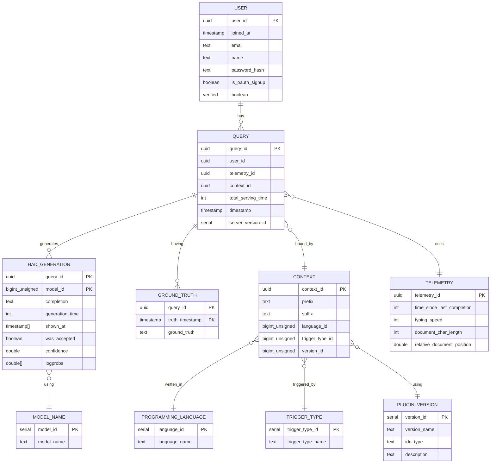

## Database Schema for Code4meV2

**Note: image of database design available at the end of the document**

## Tables
### `user`
This table stores all registered users of the system, including both standard email/password users and OAuth-based signups. It is used for authentication, authorization, and account management.

| Column Name       | Type      | Description                                                                |
|-------------------|-----------|----------------------------------------------------------------------------|
| `user_id`         | UUID      | Unique identifier for the user. **Primary Key**.                           |
| `joined_at`       | TIMESTAMP | Timestamp indicating when the user account was created.                    |
| `email`           | TEXT      | The user's email address.                                                 |
| `name`            | TEXT      | The user's display name.                                                  |
| `password_hash`   | TEXT      | A securely hashed version of the user's password.     |
| `is_oauth_signup` | BOOLEAN   | Indicates whether the user registered via an OAuth provider.              |
| `verified`        | BOOLEAN   | Flag showing whether the user's email or identity has been verified.      |

### `version_id`
This table contains the list of all the versions of the plugin that are available bound to the `ide_type`.
The (optional) description field can be used to provide a brief description of the version and the changes that have been made in the version.

- **`version_id: SERIAL`** Unique identifier for the version. **Primary Key**.
- `version_name: TEXT` Name of the (semantic) version.
- `ide_type: TEXT` Type of the IDE for which the version is available.
- `description: TEXT` Description of the version, *Optional*.

### `trigger_type`
This table contains the list of all the trigger types that are available.
The trigger types are used to determine the type of trigger that is used to generate the code.

- **`trigger_type_id: SERIAL`** Unique identifier for the trigger type, **Primary Key**.
- `trigger_type_name: TEXT` Name of the trigger type.

### `programming_language`
This table contains the list of all the programming languages that are available.
The programming languages are used to determine the language in which the code is generated.

- **`language_id: SERIAL`** Unique identifier for the programming language, **Primary Key**.
- `language_name: TEXT` Name of the programming language.

### `model_name`
This table contains the list of all the models that are available.
The models are used to determine the model that is used to generate the code.

- **`model_id: SERIAL`** Unique identifier for the model, **Primary Key**.
- `model_name: TEXT` Name of the model.

### `query`
This table contains the list of all the generations that have been requested.
This table is the central table in the database and contains all the metadata related to the generation request.

###### Computed Server-Side

- **`query_id: UUID`** for the generation request, **Primary Key**.
- `total_serving_time: INTEGER` total request processing time, in milliseconds.
- `query_timestamp: TIMESTAMP` timestamp at which the query was made.
- `telemetry_id: UUID` &rarr; [`telemetry`](#telemetry) ID for the telemetry used.
- `context_id: UUID` &rarr; [`context`](#context) ID for the context used.
- `server_version_id: BIGINT` &rarr; [`version_id`](#version_id) ID for the server version used.

###### Computed Client-Side

- `user_id: UUID` &rarr; [`user`](#user) who requested the generation.
- `timestamp: TIMESTAMP` timestamp at which the query was made.

### `had_generation`

This table contains all the completions that have been generated; the actual code as well as generation-related metadata. 

###### Computed Server-Side
- **`query_id: UUID`** &rarr; [`query`](#query) Unique identifier for the query, **Primary Key**. 
- **`model_id: BIGINT`** &rarr; [`model_name`](#model_name) ID for the model used, **Primary Key**.
- `completion: TEXT` The code that has been generated.
- `generation_time: INTEGER` Time taken to generate the code, in milliseconds.
- `confidence: FLOAT` Confidence of the model in the generated code.
- `logprobs: FLOAT[]` Log probabilities of the generated tokens.

###### Computed Client-Side (& MUTABLE)

- `shown_at: TIMESTAMP[]` The times at which the completion was shown to the user.
- `was_accepted: BOOLEAN` Whether the completion was accepted or not.

### `ground_truth`
This table contains the ground truth for the completions that have been generated.
The ground truth is the code that the user was actually looking for when they requested the completion.

- **`query_id: UUID`** &rarr; [`query`](#query) Unique identifier for the generation request, **Primary Key**.
- **`truth_timestamp: TIMESTAMP`** Timestamp at which the ground truth was provided, **Primary Key**.
- `ground_truth_text: TEXT` The code that the user was actually looking for.

### `context`

This table contains the context for the generation request.

- **`context_id: UUID`** Unique identifier for the context, **Primary Key**.
- `prefix: TEXT` The code that comes before the cursor position.
- `suffix: TEXT` The code that comes after the cursor position.
- `language_id: BIGINT` &rarr; [`programming_language`](#programming_language) ID for the language used.
- `trigger_type_id: BIGINT` &rarr; [`trigger_type`](#trigger_type) ID for the trigger type used.
- `version_id: BIGINT` &rarr; [`version_id`](#version_id) ID for the version used.

### `telemetry`

This table contains the telemetry data for the generation request.

- **`telemetry_id: UUID`** Unique identifier for the telemetry data, **Primary Key**.
- `time_since_last_completion: INTEGER` Time since the last completion, in milliseconds.
- `typing_speed: INTEGER` Typing speed of the user at the time of the request.
- `document_char_length: INTEGER` Length of the document.
- `relative_document_position: DOUBLE` Relative position of the cursor in the document.

## General Notes
- The database has been designed in a way to enable modularity and scalability.
  - With the given schema it becomes very simple to add new models, trigger types, IDE types, programming languages, and versions.
  - The schema has been normalized to be in 3NF to minimize complications that might arise as the result of anomalies.
  - The schema has been designed to be scalable and can be easily extended to include more tables and fields as required.
- The database has been designed to favor OLTP operations over OLAP operations in order to provide a faster response time for the users.
- The database has been designed to be used with a REST API.

## Updates
*The database as presented in the init_sql file is basically the base schema for the database. The database is subject to change in the future as the requirements of the project change.

