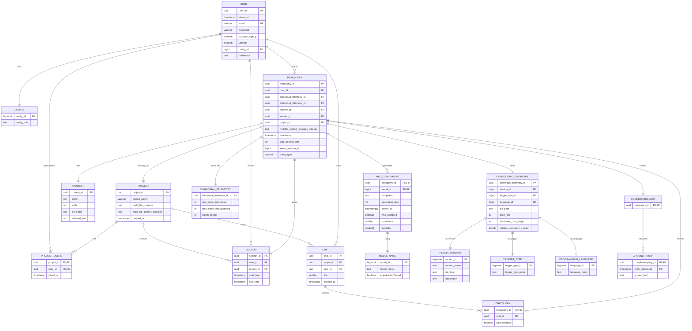

## Database Schema for Code4meV2

**Note: This is the updated database design for Code4meV2 with chat support, project management, and enhanced telemetry tracking.**

## Testing
To test the crud operations on the database schema, make sure the test_db container on docker is running and run the test_user_crud.py file located in tests/database_tests  

## Database Schema Diagram

## Database Schema Details

### Core Tables

#### `config`
Configuration settings shared across users.

| Column | Type | Description |
|--------|------|-------------|
| `config_id` | BIGSERIAL | Primary key |
| `config_data` | TEXT | JSON configuration |

#### `user`
Enhanced user management with preferences.

| Column | Type | Description |
|--------|------|-------------|
| `user_id` | UUID | Primary key |
| `joined_at` | TIMESTAMP | Account creation time |
| `email` | VARCHAR | Unique email address |
| `name` | VARCHAR | Display name |
| `password` | VARCHAR | Hashed password (Argon2) |
| `is_oauth_signup` | BOOLEAN | OAuth registration flag |
| `verified` | BOOLEAN | Email verification status |
| `config_id` | BIGINT | FK to config |
| `preference` | TEXT | User preferences (JSON) |

#### `project`
Collaborative workspaces.

| Column | Type | Description |
|--------|------|-------------|
| `project_id` | UUID | Primary key |
| `project_name` | VARCHAR | Project name |
| `multi_file_contexts` | TEXT | Multi-file context data (JSON) |
| `multi_file_context_changes` | TEXT | Context change tracking (JSON) |
| `created_at` | TIMESTAMP | Creation time |

#### `project_users`
Many-to-many user-project relationships.

| Column | Type | Description |
|--------|------|-------------|
| `project_id` | UUID | PK, FK to project |
| `user_id` | UUID | PK, FK to user |
| `joined_at` | TIMESTAMP | When user joined project |

#### `session`
User sessions within projects.

| Column | Type | Description |
|--------|------|-------------|
| `session_id` | UUID | Primary key |
| `user_id` | UUID | FK to user |
| `project_id` | UUID | FK to project |
| `start_time` | TIMESTAMP | Session start |
| `end_time` | TIMESTAMP | Session end (nullable) |

#### `chat`
Chat conversations in projects.

| Column | Type | Description |
|--------|------|-------------|
| `chat_id` | UUID | Primary key |
| `project_id` | UUID | FK to project |
| `user_id` | UUID | FK to chat owner |
| `title` | VARCHAR | Chat title |
| `created_at` | TIMESTAMP | Creation time |

### Query System (Polymorphic Inheritance)

#### `metaquery`
Base table for all query types.

| Column | Type | Description |
|--------|------|-------------|
| `metaquery_id` | UUID | Primary key |
| `user_id` | UUID | FK to user (nullable) |
| `contextual_telemetry_id` | UUID | FK to contextual telemetry |
| `behavioral_telemetry_id` | UUID | FK to behavioral telemetry |
| `context_id` | UUID | FK to context |
| `session_id` | UUID | FK to session |
| `project_id` | UUID | FK to project |
| `multifile_context_changes_indexes` | TEXT | Context changes (JSON) |
| `timestamp` | TIMESTAMP | Query time |
| `total_serving_time` | INT | Processing time (ms) |
| `server_version_id` | BIGINT | Server version |
| `query_type` | VARCHAR | 'completion' or 'chat' |

#### `completionquery`
Code completion queries.

| Column | Type | Description |
|--------|------|-------------|
| `metaquery_id` | UUID | PK, FK to metaquery |

#### `chatquery`
Chat/conversation queries.

| Column | Type | Description |
|--------|------|-------------|
| `metaquery_id` | UUID | PK, FK to metaquery |
| `chat_id` | UUID | FK to chat |
| `web_enabled` | BOOLEAN | Web access enabled |

### Context & Telemetry

#### `context`
Code context information.

| Column | Type | Description |
|--------|------|-------------|
| `context_id` | UUID | Primary key |
| `prefix` | TEXT | Code before cursor |
| `suffix` | TEXT | Code after cursor |
| `file_name` | TEXT | File name |
| `selected_text` | TEXT | Selected text |

#### `contextual_telemetry`
Environment and context data.

| Column | Type | Description |
|--------|------|-------------|
| `contextual_telemetry_id` | UUID | Primary key |
| `version_id` | BIGINT | FK to plugin_version |
| `trigger_type_id` | BIGINT | FK to trigger_type |
| `language_id` | BIGINT | FK to programming_language |
| `file_path` | TEXT | File path |
| `caret_line` | INT | Cursor line number |
| `document_char_length` | INT | Document length |
| `relative_document_position` | DOUBLE | Cursor position (0.0-1.0) |

#### `behavioral_telemetry`
User behavior data.

| Column | Type | Description |
|--------|------|-------------|
| `behavioral_telemetry_id` | UUID | Primary key |
| `time_since_last_shown` | INT | Time since last completion (ms) |
| `time_since_last_accepted` | INT | Time since last acceptance (ms) |
| `typing_speed` | INT | Typing speed (chars/min) |

### AI Generation & Results

#### `had_generation`
AI-generated content.

| Column | Type | Description |
|--------|------|-------------|
| `metaquery_id` | UUID | PK, FK to metaquery |
| `model_id` | BIGINT | PK, FK to model_name |
| `completion` | TEXT | Generated content |
| `generation_time` | INT | Generation time (ms) |
| `shown_at` | TIMESTAMP[] | When shown to user |
| `was_accepted` | BOOLEAN | User acceptance |
| `confidence` | DOUBLE | Model confidence |
| `logprobs` | DOUBLE[] | Token probabilities |

#### `ground_truth`
Actual user code for training.

| Column | Type | Description |
|--------|------|-------------|
| `completionquery_id` | UUID | PK, FK to completionquery |
| `truth_timestamp` | TIMESTAMP | PK, when recorded |
| `ground_truth` | TEXT | Actual code |

### Reference Tables

#### `model_name`, `plugin_version`, `trigger_type`, `programming_language`
Reference data for models, IDE versions, trigger types, and programming languages.

## Database Constraints & Integrity ✅

### Foreign Key Constraints
All foreign key relationships properly configured with appropriate cascade behavior:

- **CASCADE**: `project_users`, `session`, `chat`, `metaquery`, `chatquery`, `had_generation`, `ground_truth`
- **SET NULL**: `metaquery.user_id` (preserve queries when user deleted)
- **RESTRICT**: Reference tables (config, model_name, etc.)

### Indexes
Performance indexes on:
- All foreign keys
- Frequently queried columns (email, project_id, user_id, session_id)
- Composite indexes for generation lookup

### Data Integrity
- **Email uniqueness**: Enforced at database level
- **Password validation**: Enforced at application level (Pydantic)
- **UUID primary keys**: Prevent key collisions
- **Timestamp tracking**: Automatic for creation times
- **JSON validation**: Structured preferences and configuration

### TODO for Production
1. **SQLAlchemy Relationship Configuration**: Update relationship cascade settings in `db_schemas.py`
2. **Connection Pooling**: Configure for production load
3. **Backup Strategy**: Implement automated backups
4. **Monitoring**: Add query performance monitoring
5. **Migrations**: Set up schema migration system